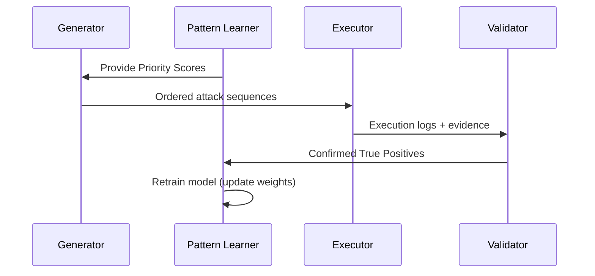

# 🛡️ VulnHunter Pro — Intelligent Business Logic Scanner

VulnHunter Pro is an adaptive, AI-driven security testing tool designed to find complex business logic flaws (Workflow Bypass, Price Manipulation, Privilege Escalation) that traditional DAST scanners miss. It uses validated True Positive findings to continuously train a lightweight ML model and prioritize high-probability attack sequences.

---

## 🚀 Quick Start

### Prerequisites
- Python 3.10+

### Installation
```bash
git clone https://github.com/YourOrg/VulnHunter_Pro.git
cd VulnHunter_Pro
python -m venv venv
source venv/bin/activate  # On Windows: venv\Scripts\activate
pip install -r requirements.txt
mkdir ai_data
# confirmed_vulnerabilities.csv will be created on first run
```

### Run
**Interactive dashboard (recommended)**
```bash
streamlit run src/ui/dashboard.py
```

**CLI**
```bash
python main.py --url http://api.target-domain.com --template attacks/templates/ecommerce_checkout.yaml
```

---

## 🧠 Architecture Overview

VulnHunter Pro is organized into modular components that operate inside a single, stateful orchestration loop.

Mermaid architecture diagram (rendered on GitHub / Mermaid-capable viewers):

```mermaid
flowchart LR
  A[Reconnaissance] --> B[Business Logic Tester]
  B --> C[Orchestrator (Executor)]
  C --> D[Verification Engine (Validator)]
  D --> E[AI Pattern Learner (Brain)]
  E --> B
  subgraph Runtime
    C
    D
  end

  style A fill:#f9f,stroke:#333,stroke-width:1px
  style B fill:#fffae6,stroke:#333,stroke-width:1px
  style C fill:#e6f7ff,stroke:#333,stroke-width:1px
  style D fill:#e6ffe6,stroke:#333,stroke-width:1px
  style E fill:#fff0f6,stroke:#333,stroke-width:1px
```

### Component Responsibilities
- **Reconnaissance**: fingerprint target tech stack, discover endpoints, enumerate workflows.
- **Business Logic Tester (Generator)**: converts `WorkflowTemplate` YAMLs into `LogicAttack` sequences (stateful multi-step requests).
- **Orchestrator (Executor)**: executes attacks using a persistent `httpx` session, handles dynamic data extraction and state tracking.
- **Verification Engine (Validator)**: applies success criteria against execution logs to determine True Positives and produces PoC artifacts.
- **AI Pattern Learner (Brain)**: trains a lightweight Logistic Regression model on confirmed findings and produces a `Priority Score` for future attacks.

---

## 🔁 AI Feedback Workflow

Mermaid workflow diagram:



**Loop description**
1. **Prioritization** — `AI Pattern Learner` scores generated attacks.
2. **Execution** — `Orchestrator` runs high-priority attacks first.
3. **Validation** — `Verification Engine` checks success criteria and marks True Positives.
4. **Learning** — confirmed findings retrain the model to shift priorities.

---

## 🗂️ File Structure (important paths)

```
VulnHunter_Pro/
├─ src/
│  ├─ core/
│  │  └─ data_models.py          # Pydantic schemas (WorkflowTemplate, LogicAttack, etc.)
│  ├─ modules/
│  │  ├─ logic_tester.py         # BusinessLogicTester (generator)
│  │  ├─ orchestrator.py         # Executor
│  │  └─ validator.py            # Verification Engine
│  ├─ ai/
│  │  └─ learner.py              # AI Pattern Learner (Logistic Regression)
│  └─ ui/
│     └─ dashboard.py            # Streamlit dashboard
├─ attacks/
│  └─ templates/                 # WorkflowTemplate YAMLs
└─ ai_data/
   └─ confirmed_vulnerabilities.csv
```

---

## 🛠️ Extensibility Guide

### Adding new workflows
- Add a YAML file to `attacks/templates/` following the `WorkflowTemplate` schema in `src/core/data_models.py`.
- Use dynamic placeholders like `{cart_id}` to reference previous step outputs.

### Adding attack strategies
- Edit `src/modules/logic_tester.py`.
- Add a method like `_generate_price_manipulation()` returning `List[LogicAttack]`.
- Ensure it is called by `generate_all_attacks()` so attacks are included and scored.

---

## ✅ Verification & Evidence
The `Verification Engine`:
- Parses execution logs to apply success criteria (e.g., unauthorized state change, altered price, or final HTTP status).
- Produces a PoC script and attaches technical evidence (HTTP requests/responses, extracted variables).

---

## ⚙️ AI Learner Details
- Model: Lightweight Logistic Regression (scikit-learn).
- Features: `attack_type`, `target_stack`, `previous_success_rates`, `template_tags` (e.g., "checkout", "admin-flow").
- Feedback loop: Each confirmed finding is appended to `ai_data/confirmed_vulnerabilities.csv` and triggers a retrain.

---

## 🧪 Example Workflow Template (YAML snippet)
```yaml
name: ecommerce_checkout
steps:
  - id: create_cart
    method: POST
    path: /api/cart
    body:
      items: [{ "sku": "ABC", "qty": 1 }]
  - id: update_price
    method: PATCH
    path: /api/cart/{cart_id}/items/0
    body:
      price: 0.01
  - id: checkout
    method: POST
    path: /api/checkout
    body:
      cart_id: "{cart_id}"
success_criteria:
  - type: status_code
    value: 200
  - type: state_change
    description: "Order total less than expected"
```

---

## 🧾 Contribution & License
Contributions are welcome. Follow standard GitHub PR flow and include tests for new attack generators and validators.

Licensed under MIT — adapt as necessary for your org.

---

## Appendix — Diagrams (raw Mermaid)
- Architecture diagram: see above under **Architecture Overview**
- Workflow diagram: see above under **AI Feedback Workflow**

---

*Generated: README.md for VulnHunter Pro. If you'd like a PDF, a ZIP with examples, or a rendered PNG of the diagrams, tell me which format and I'll include it.*
